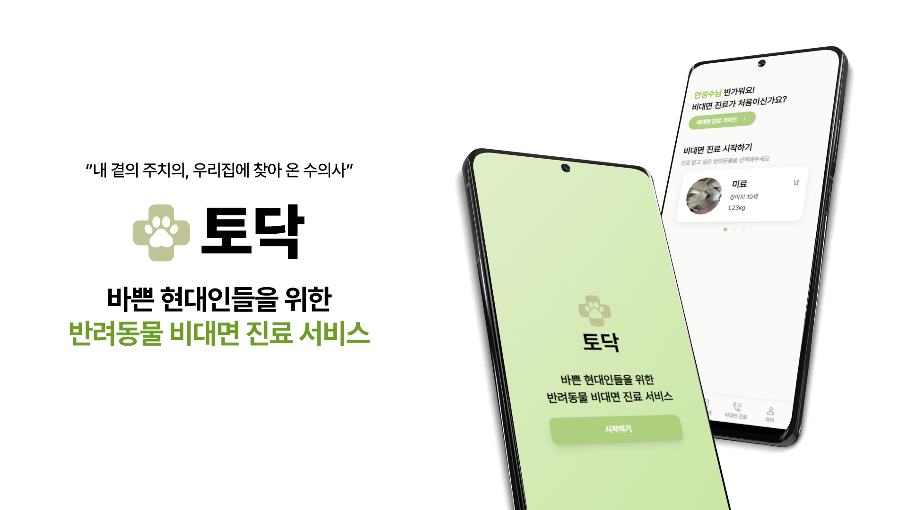
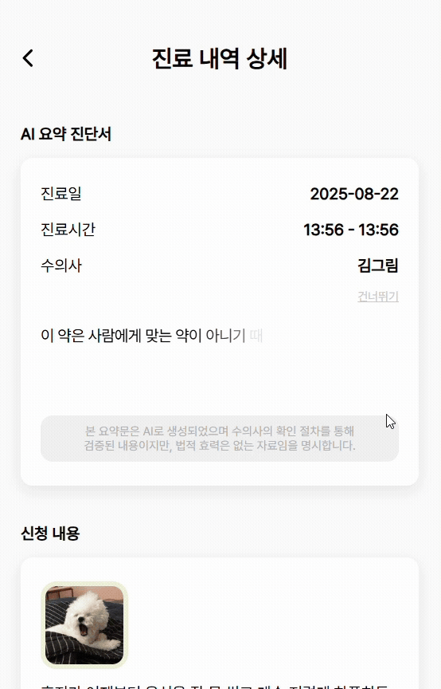
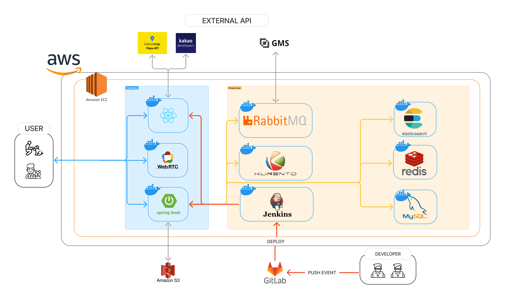

<div align="center">
  <h1 style="display: flex; align-items: center; justify-content: center; width: 100%;">
    토닥
  </h1>
</div>

<br/>

## 📜 목차
1. [서비스 개요](#서비스-개요)
2. [주요 기능](#주요-기능)
3. [기술 스택](#기술-스택)
4. [아키텍처 구성](#아키텍처-구성)
5. [폴더 구조](#폴더-구조)
6. [팀원 소개](#팀원-소개)

## 📝 프로젝트 개요

> **개발 기간** : `2025.07.14 ~ 2025.08.18(6주)`

**토닥**은 병원 방문이 어려운 바쁜 반려인들을 위한 반려동물 **비대면 의료 서비스**입니다.
<br/>
관찰 진료가 필요하거나 병원에 대한 스트레스가 높은 반려동물들이 병원에 방문하지 않고 시간과 공간에 제약 없이 진료 받을 수 있도록 서비스를 제공합니다.
<br/>

## ⚡ 핵심 기능
> 토닥은 반려인, 수의사 , 병원 관계자 3가지의 사용자 유형이 존재
<div class=flex>


</div>


## 1. 반려인
### 반려동물 관리
- **프로필 등록** : 반려동물의 정보를 프로필 형태로 등록하여 정보 열람 및 관리

| 프로필 등록 |
| :---: |
| <p align="center"></p>|

  
### 진료 내역 조회
- **예약 요약 제공** : 작성했던 진료 신청서 내용을 요약해 어떤 진료 내역인지 한눈에 확인 가능
- **AI 요약 진단서** : 수의사의 검증을 거친 AI 요약 진단서 보관

| 진료 내역 조회 |
| :---: |
| <p align="center">


### 예약 신청
- **신청서 작성** : 원하는 병원과 수의사를 검색 후 선택하고, 증상 입력
- **자동 결제 수단 선택** : 카카오페이 결제를 통해 예약을 확정하고 승인 대기 상태로 전환

| 예약 신청 |
| :---: |
| <p align="center"></p>| 


## 2. 수의사
### 비대면 진료
- **실시간 1:1진료** : Kurento 기반 WebRTC 기술을 활용하여 원격 화상 진료 지원

| 진료 대기 목록 | 비대면 진료 |
| :---: | :---: |
| <p align="center">| <p align="center"></p>|


### 진단서 검토
- **STT → text 변환** : Whisper-1을 이용해 비대면 진료 중 음성을 텍스트 파일로 변환
- **AI text 요약** : 의료 용어가 많은 텍스트를 ChatGPT 4.1을 통해 핵심 내용 요약
- **수의사 검증** : 수의사의 검토 절차를 통해 수정, 승인

| 진단서 검토 |
| :---: |
| <p align="center"></p>| 


## 3. 병원 관계자
### 진료 일정 관리
- **진료 가능 시간 관리** : 예약 가능 시간을 버튼 토클 방식으로 가능/불가 설정

| 진료 가능 시간 관리 |
| :---: |
| <p align="center"></p>| 


### 예약 관리
- **신청 목록 확인** : 전체 예약 내역을 조회하고, 내용을 검토한 뒤 승인 또는 반려 처리 가능

| 예약 승인 | 예약 반려|
| :---: | :---:|
| <p align="center">| <p align="center"> </p>| 


### 결제 관리
- **수납** : 진료 종료 후 결제 금액 입력 → 자동 결제 요청

| 수납 |
| :---: |
| <p align="center"><</p>| 


## ⚙️ 기술 스택

### Frontend
- Language: TypeScript
- Framework: React 19
- UI/스타일링: TailwindCSS
- 상태 관리: Zustand
- 라우팅: React Router Dom
- 개발 도구: Vit

### Backend

- Language: Java 17
- Framework: Spring Boot 3.3.3
- Database: MySQL, Redis, Elasticsearch
- ORM: Spring Data JPA
- 인증/보안: JWT (jjwt), Spring Security
- 메시징 서비스: RabbitMQ
- API 문서화: Swagger
- 웹소켓: Spring WebSocket
- 개발 도구: Lombok, Devtools
- AI : GMS

### Infra 
- Containerization: Docker
- CI/CD: Jenkins
- Cloud: AWS ,S3 Bucket

## 📐아키텍처 구성 

### 시스템 아키텍처



## 📂폴더 구조
```
TODAK/
│
├── frontend/                               # React + Vite + TypeScript 기반 프론트엔드
│
├── backend/                                # Spring Boot 기반 백엔드
└── README.md                       
```

## 👥팀원 소개
| 이대연 | 김유성 | 송인범 | 안성수 | 전윤지 | 한진경 |
|-------------|--------|--------|--------|--------|--------|
| FE, 팀장         | BE     | BE     | BE     | FE     | FE     |


